<!--
┌──────────────────────────────────────┐
│  verdant · generated, never written  │
└──────────────────────────────────────┘

one yaml file describes me. a python script renders it.
nothing on this page was placed by hand.

fork it if you want one.
-->

  
  
  
  

<code>&#9656;&nbsp; $ cat profile.md</code>

 

  

<code>&#9656;&nbsp; $ printenv</code>

 

  

<code>&#9656;&nbsp; $ cat .env</code>

 

  

  

<a href="mailto:sasichandan.23@gmail.com">mail</a> &nbsp;&#183;&nbsp; <a href="https://github.com/sasichandan23">github</a>

